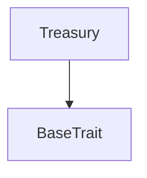
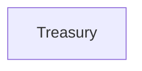

# Tact compilation report
Contract: Treasury
BoC Size: 3401 bytes

## Structures (Structs and Messages)
Total structures: 17

### DataSize
TL-B: `_ cells:int257 bits:int257 refs:int257 = DataSize`
Signature: `DataSize{cells:int257,bits:int257,refs:int257}`

### SignedBundle
TL-B: `_ signature:fixed_bytes64 signedData:remainder<slice> = SignedBundle`
Signature: `SignedBundle{signature:fixed_bytes64,signedData:remainder<slice>}`

### StateInit
TL-B: `_ code:^cell data:^cell = StateInit`
Signature: `StateInit{code:^cell,data:^cell}`

### Context
TL-B: `_ bounceable:bool sender:address value:int257 raw:^slice = Context`
Signature: `Context{bounceable:bool,sender:address,value:int257,raw:^slice}`

### SendParameters
TL-B: `_ mode:int257 body:Maybe ^cell code:Maybe ^cell data:Maybe ^cell value:int257 to:address bounce:bool = SendParameters`
Signature: `SendParameters{mode:int257,body:Maybe ^cell,code:Maybe ^cell,data:Maybe ^cell,value:int257,to:address,bounce:bool}`

### MessageParameters
TL-B: `_ mode:int257 body:Maybe ^cell value:int257 to:address bounce:bool = MessageParameters`
Signature: `MessageParameters{mode:int257,body:Maybe ^cell,value:int257,to:address,bounce:bool}`

### DeployParameters
TL-B: `_ mode:int257 body:Maybe ^cell value:int257 bounce:bool init:StateInit{code:^cell,data:^cell} = DeployParameters`
Signature: `DeployParameters{mode:int257,body:Maybe ^cell,value:int257,bounce:bool,init:StateInit{code:^cell,data:^cell}}`

### StdAddress
TL-B: `_ workchain:int8 address:uint256 = StdAddress`
Signature: `StdAddress{workchain:int8,address:uint256}`

### VarAddress
TL-B: `_ workchain:int32 address:^slice = VarAddress`
Signature: `VarAddress{workchain:int32,address:^slice}`

### BasechainAddress
TL-B: `_ hash:Maybe int257 = BasechainAddress`
Signature: `BasechainAddress{hash:Maybe int257}`

### RoomData
TL-B: `_ entry_fee:int257 winners_count:int257 status:int257 pool:int257 total_entries:int257 paid_hash:int257 created_at:int257 closed_at:int257 = RoomData`
Signature: `RoomData{entry_fee:int257,winners_count:int257,status:int257,pool:int257,total_entries:int257,paid_hash:int257,created_at:int257,closed_at:int257}`

### OpenRoom
TL-B: `open_room#9bf17ad8 room_key:uint32 entry_fee:coins winners_count:uint8 = OpenRoom`
Signature: `OpenRoom{room_key:uint32,entry_fee:coins,winners_count:uint8}`

### EnterRoom
TL-B: `enter_room#524ba968 room_key:uint32 entry_fee:coins = EnterRoom`
Signature: `EnterRoom{room_key:uint32,entry_fee:coins}`

### CloseRoom
TL-B: `close_room#af78e69c room_key:uint32 = CloseRoom`
Signature: `CloseRoom{room_key:uint32}`

### DistributePayouts
TL-B: `distribute_payouts#d44210f3 room_key:uint32 winners_count:uint8 winners:dict<int, address> = DistributePayouts`
Signature: `DistributePayouts{room_key:uint32,winners_count:uint8,winners:dict<int, address>}`

### ClaimReward
TL-B: `claim_reward#cebb8d49 room_key:uint32 winner_address:address = ClaimReward`
Signature: `ClaimReward{room_key:uint32,winner_address:address}`

### Treasury$Data
TL-B: `_ owner:address upgrade_authority:address airdrop_pool:int257 airdrop_id:int257 rooms:dict<int, ^RoomData{entry_fee:int257,winners_count:int257,status:int257,pool:int257,total_entries:int257,paid_hash:int257,created_at:int257,closed_at:int257}> current_room_id:int257 winner_rewards:dict<address, int> claimed_rewards:dict<address, int> HOUSE_FEE_BPS:int257 HOUSE_FEE_DENOMINATOR:int257 = Treasury`
Signature: `Treasury{owner:address,upgrade_authority:address,airdrop_pool:int257,airdrop_id:int257,rooms:dict<int, ^RoomData{entry_fee:int257,winners_count:int257,status:int257,pool:int257,total_entries:int257,paid_hash:int257,created_at:int257,closed_at:int257}>,current_room_id:int257,winner_rewards:dict<address, int>,claimed_rewards:dict<address, int>,HOUSE_FEE_BPS:int257,HOUSE_FEE_DENOMINATOR:int257}`

## Get methods
Total get methods: 10

## getOwner
No arguments

## getUpgradeAuthority
No arguments

## getAirdropPool
No arguments

## getAirdropId
No arguments

## getCurrentRoomId
No arguments

## getHouseFeeBps
No arguments

## getHouseFeeDenominator
No arguments

## getRoomData
Argument: room_key

## getWinnerReward
Argument: _
Argument: addr

## getClaimedReward
Argument: _
Argument: addr

## Exit codes
* 2: Stack underflow
* 3: Stack overflow
* 4: Integer overflow
* 5: Integer out of expected range
* 6: Invalid opcode
* 7: Type check error
* 8: Cell overflow
* 9: Cell underflow
* 10: Dictionary error
* 11: 'Unknown' error
* 12: Fatal error
* 13: Out of gas error
* 14: Virtualization error
* 32: Action list is invalid
* 33: Action list is too long
* 34: Action is invalid or not supported
* 35: Invalid source address in outbound message
* 36: Invalid destination address in outbound message
* 37: Not enough Toncoin
* 38: Not enough extra currencies
* 39: Outbound message does not fit into a cell after rewriting
* 40: Cannot process a message
* 41: Library reference is null
* 42: Library change action error
* 43: Exceeded maximum number of cells in the library or the maximum depth of the Merkle tree
* 50: Account state size exceeded limits
* 128: Null reference exception
* 129: Invalid serialization prefix
* 130: Invalid incoming message
* 131: Constraints error
* 132: Access denied
* 133: Contract stopped
* 134: Invalid argument
* 135: Code of a contract was not found
* 136: Invalid standard address
* 138: Not a basechain address
* 2493: Entry fee must be positive
* 5883: Room is not open
* 6225: No reward for this address
* 10215: Room is not paid
* 14103: Room not found
* 14506: Too many winners
* 16751: Room already paid
* 20618: Room does not exist
* 27407: Room already exists
* 39893: Winners count must be positive
* 40266: Room key must be positive
* 43137: No remaining reward to claim
* 49080: No airdrop pool available
* 50845: Room is not closed
* 51351: Entry fee must be exact amount
* 58501: Entry fee mismatch
* 62631: Winners count mismatch

## Trait inheritance diagram

## Contract dependency diagram

